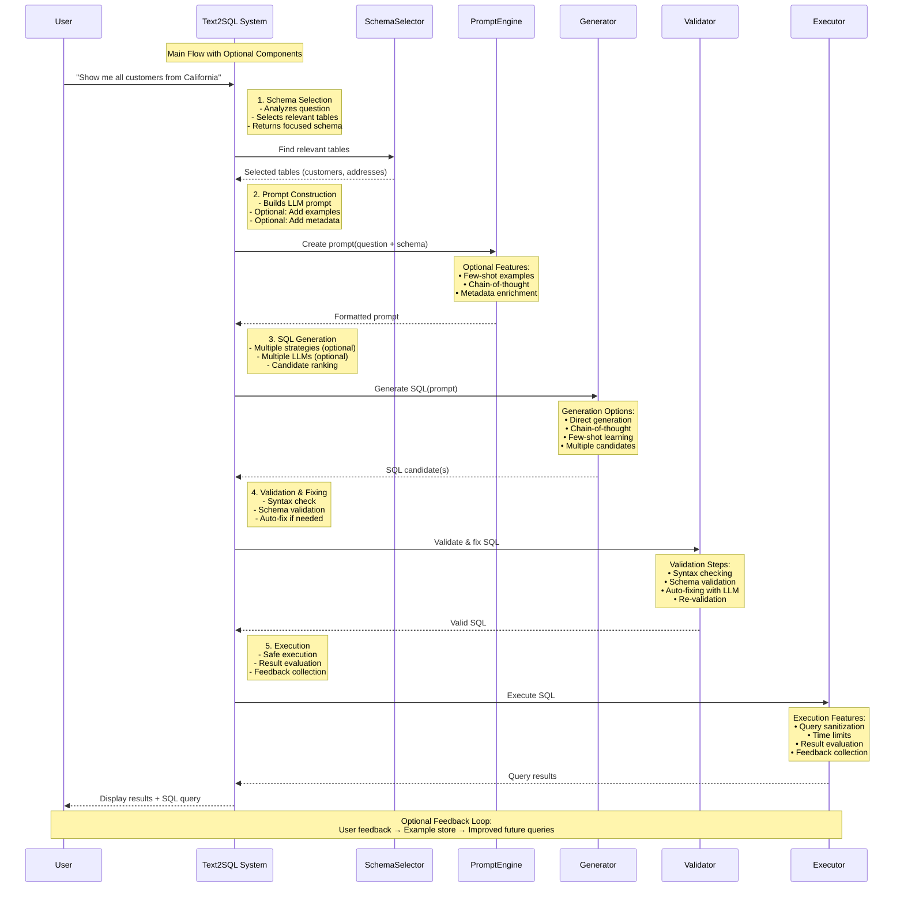

# SQL QA Project

This is a SQL Question Answering application that allows users to interact with a database using natural language. The application uses LangChain and Mistral AI to translate natural language questions into SQL queries and provide answers.

## Project Structure

```text
SQL-QA
├── main.py                 # Main application entry point
├── shared/                 # Shared utilities
│   └── src/
│       └── shared/
│           ├── db.py       # Database connection utilities
│           └── logger.py   # Logging utilities
├── logs/                   # Log files directory
├── requirements.txt        # Project dependencies
└── README.md              # Project documentation
```

## Features

- Natural language to SQL query translation
- Interactive command-line interface
- Comprehensive logging of all interactions
- Support for various SQL databases (MySQL, SQLite)
- Verbose mode for debugging and understanding agent reasoning



## Prerequisites

- Python 3.10+

## Installation

1. Clone the repository:

```bash
git clone <repository-url>
cd SQL-QA
```

2. Create and activate a virtual environment:

```bash
python -m venv .venv
# On Windows
.venv\Scripts\activate
# On Unix or MacOS
source .venv/bin/activate
```

3. Install dependencies:

```bash
uv sync
```

4. Set up environment variables:
   - Create a `.env` file in the project root using `.env.example`

5. Generate sample database (if using SQLite):

```bash
curl -s https://raw.githubusercontent.com/lerocha/chinook-database/master/ChinookDatabase/DataSources/Chinook_Sqlite.sql | sqlite3 Chinook.db
```

## Usage

Run the application:

```bash
# API version
uv run uvicorn src.sql_qa.cli:app --reload --port 8000

# Then test
curl -X POST http://localhost:8000/v1/chat/completions \
-H "Content-Type: application/json" \
-d '{
  "model": "gpt-3.5-turbo",
  "messages": [
    {
      "role": "user",
      "content": "có bao nhiêu khách hàng trong CSDL?"
    }
  ],
  "temperature": 0.7,
  "stream": false
}'

# UI version
uv run streamlit run ./src/sql_qa/ui.py

# Benchmark 
uv run ./cli.py benchmark --file data/GSV/generated-data/gen_success_data.csv

# Evaluation
# For separate files
python -m src.sql_qa.metrics.evaluation evaluate-files \
    --predicted-file predicted_queries.sql \
    --ground-truth-file ground_truth_queries.sql \
    --output-file results.json

# For CSV file
python -m src.sql_qa.metrics.evaluation evaluate-csv \
    --input-file benchmark_results.csv \
    --output-file results.json
```

Options:

- `--verbose`: Enable verbose mode to see agent thoughts (default: True)

## License

[Specify your license here]

## Challenges

```text
E:\code\AI\agentic-AI\SQL-QA\.venv\Lib\site-packages\langchain_community\utilities\sql_database.py:348: SAWarning: Cannot correctly sort tables; there are unresolvable cycles between tables "employee, examination, package, patient, return_customer, user", which is usually caused by mutually dependent foreign key constraints.  Foreign key constraints involving these tables will not be considered; this warning may raise an error in a future release.
```
