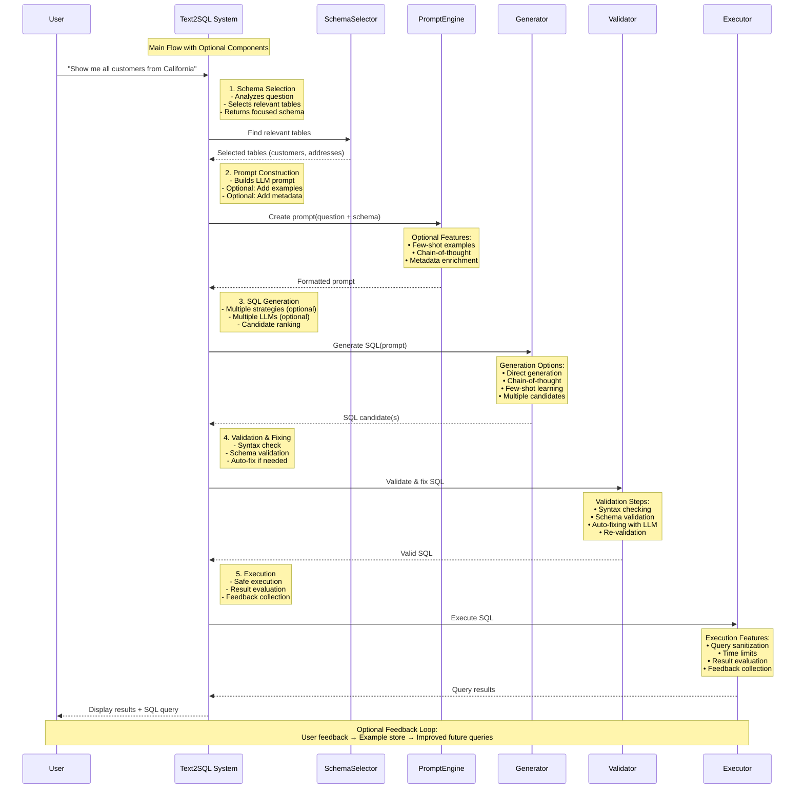

# SQL QA Project

This is a SQL Question Answering application that allows users to interact with a database using natural language. The application uses LangChain and Mistral AI to translate natural language questions into SQL queries and provide answers.

## Project Structure


## Features

- Natural language to SQL query translation
- Interactive command-line interface
- Comprehensive logging of all interactions
- Support for various SQL databases (MySQL, SQLite)
- Verbose mode for debugging and understanding agent reasoning
- SQL pair filtering and evaluation tools



## Installation

1. Clone the repository:

```bash
git clone https://github.com/huypl53/sql-agent
cd sql-agent
```

2. Create and activate a virtual environment:

```bash
# make sure uv installed
# create venv
uv venv
# On Windows
.venv\Scripts\activate
# On Unix or MacOS
source .venv/bin/activate
```

3. Install dependencies:

```bash
uv sync
```

4. Set up environment variables:
   - Create a `.env` file in the project root using `.env.example`

5. Generate sample database (using SQLite, if not skip this then use your own DB):

```bash
curl -s https://raw.githubusercontent.com/lerocha/chinook-database/master/ChinookDatabase/DataSources/Chinook_Sqlite.sql | sqlite3 Chinook.db
```

6. Install chart visulization server

```bash
npm install -g @antv/mcp-server-chart
```

## Usage

- Update config at `conf/config.yaml`
- Start MCP servers:
```bash
## Start mpc-chart-server
mcp-server-chart --transport sse --port 1122

## Start MCP SQL server
uv run -m sql_qa.serving.sql mcp-server --transport sse --port 8000
```

- Start chat bot API
> This bot makes the conversation smoothly by clarifying user intent in conversation before sending question to text2sql module (ran via MCP server above)
```bash
uv run -m src.sql_qa.serving.bot start --host '127.0.0.1' --port 5000 --reload
```

- Test API

```bash
# Then test
curl -X POST http://localhost:5000/v1/chat/completions \
-H "Content-Type: application/json" \
-d '{
  "model": "gpt-3.5-turbo",
  "messages": [
    {
      "role": "user",
      "content": "cho tôi doanh số tháng 4 của từng cơ sở"
    }
  ],
  "temperature": 0.7,
  "stream": false
}'
```

## Evaluation

```bash
# Benchmark text2sql module only
# CSV data should contain `question` column
uv run ./src/sql_qa/serving/sql.py benchmark \
    --col-question question \
    --file data/GSV/generated-data/gen_success_data.csv

```

## License

[Specify your license here]

